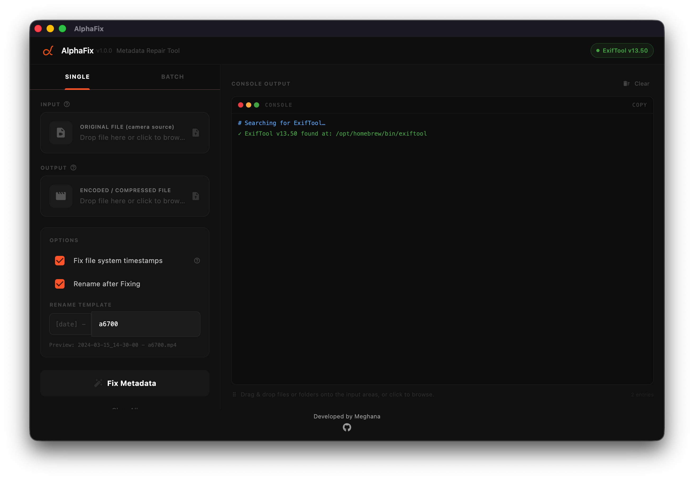

<div align="center">  <h1>AlphaFix</h1> <p>Fix your camera video metadata after re-encoding.</p> <p> <a href="#download">  </a> <a href="#download">  </a> <a href="#download">  </a> <a href="https://flutter.dev">  </a> </p> <p>  <a href="LICENSE">  </a> <a href="https://exiftool.org">  </a> <a href="https://github.com/im-meghana/alphafix">  </a> </p> <br/> <p> <a href="https://buymeacoffee.com/im-meghana">  </a> <a href="https://ko-fi.com/im-meghana">  </a> <a href="https://paypal.me/im-meghana">  </a> <a href="upi://pay?pa=your-upi-id@bank&amp;pn=Meghana">  </a> </p> </div>

----------

## The Problem

When you re-encode or compress a video from a Sony (or any) camera, the metadata gets stripped. Cloud services like **Ente, Google Photos, and iCloud** then sort your videos by the wrong date, lose GPS location, or show no camera info at all.

AlphaFix fixes this using [ExifTool](https://exiftool.org/) under the hood.

----------

## Features

**Full metadata transfer**

Copy date, GPS, camera model, make and lens from original to re-encoded file

**UTC timestamp fix**

Fix wrong dates in Ente, Google Photos, iCloud without touching a second file

**Batch mode**

Process a whole folder at once -- files matched by filename, any extension

**Auto rename**

Rename output to `YYYY-MM-DD_HH-MM-SS - cameraname.ext` after fixing

**Drag and drop**

Drop files or folders straight onto the input areas

**Live console**

See exactly what ExifTool is doing in real time

**Cross platform**

macOS, Windows and Linux

----------

## Screenshots



----------

## Download

Platform

Download

macOS

[AlphaFix-1.0.0.dmg](https://github.com/im-meghana/alphafix/releases/latest)

Windows

Coming soon

Linux

Coming soon

----------

### macOS Installation

> AlphaFix is not notarized with Apple, so macOS Gatekeeper will block it on first launch. Run the command below after downloading to remove the quarantine flag.

**1. Mount and copy the app**

Open the `.dmg` and drag **AlphaFix.app** into your `/Applications` folder.

**2. Remove the quarantine attribute**

Open Terminal and run:

```bash
xattr -dr com.apple.quarantine /Applications/AlphaFix.app

```

**3. Launch**

Open AlphaFix normally from Launchpad or Finder. macOS will no longer block it.

> **Why is this needed?** macOS quarantines apps downloaded from the internet that aren't notarized by Apple. The `xattr` command safely removes that flag — it does not disable Gatekeeper system-wide.

----------

## Prerequisites

AlphaFix requires **ExifTool** to be installed on your system.

<details> <summary></summary> <br/>

```bash
brew install exiftool


```

</details> <details> <summary></summary> <br/>

**Option A - winget (recommended)**

```powershell
winget install -e --id OliverBetz.ExifTool


```

**Option B - Chocolatey**

```powershell
choco install exiftool


```

**Option C - Scoop**

```powershell
scoop install exiftool


```

**Option D - Manual**

1.  Download from [exiftool.org](https://exiftool.org/)
2.  Rename `exiftool(-k).exe` to `exiftool.exe`
3.  Move to `C:\Windows\`

</details> <details> <summary></summary> <br/>

**Ubuntu / Debian**

```bash
sudo apt install libimage-exiftool-perl


```

**Fedora / RHEL**

```bash
sudo dnf install perl-Image-ExifTool


```

**Arch**

```bash
sudo pacman -S perl-image-exiftool


```

**Snap**

```bash
sudo snap install exiftool


```

</details>

----------

## How to Use

### Single - transfer metadata after re-encoding

Use this when you have two files: the original from the camera and a compressed or re-encoded version.

1.  Drop or browse your **original camera file** into the **INPUT** slot
2.  Drop or browse your **re-encoded file** into the **OUTPUT** slot
3.  Optionally enable **Rename after fixing** and enter your camera name
4.  Click **Fix Metadata**

AlphaFix copies the creation date, GPS, camera model, make and lens info from the original into the output file.

### Single - fix UTC timestamp only

Use this when your video looks fine locally but shows the **wrong date in Ente, Google Photos or iCloud**.

This is a common Sony camera issue -- the local time tag is correct but cloud services read the UTC-based QuickTime tag, which is offset by your timezone.

1.  Select the **same file** for both INPUT and OUTPUT
2.  AlphaFix detects this and shows a **UTC-fix mode** banner
3.  Click **Fix Metadata** -- it rewrites the QuickTime UTC tag in-place, no second file needed

### Batch - process a whole folder

Use this when you have a folder of originals and a folder of re-encoded files to fix in one go.

> **Note:** Files are matched by base filename only. The extension can differ, but the name before the dot must be exactly the same in both folders -- `A001.MP4` will match `A001.mov`.

1.  Switch to the **BATCH** tab
2.  Select your **Originals folder** and your **Encoded folder**
3.  Optionally select an **Output folder** -- if left empty, encoded files are fixed in-place
4.  Click **Run Batch Fix**

A summary is printed to the console when done.

----------

## Build from Source

**Requirements**

-   [Flutter](https://flutter.dev/docs/get-started/install) 3.0+
-   Dart 3.0+
-   ExifTool installed on your system

```bash
# Clone
git clone https://github.com/im-meghana/alphafix.git
cd alphafix

# Install dependencies
flutter pub get

# Run
flutter run -d macos
flutter run -d windows
flutter run -d linux

# Release build
flutter build macos --release
flutter build windows --release
flutter build linux --release


```

----------

## Tech Stack

[](https://flutter.dev/)

UI framework

[](https://dart.dev/)

Language

[](https://exiftool.org/)

Metadata engine by Phil Harvey

`file_picker`

Native file picker dialog

`desktop_drop`

Drag and drop support

`flutter_svg`

SVG rendering

`path`

Cross-platform path handling

----------

## Contributing

Pull requests are welcome. For major changes, open an issue first.

1.  Fork the repo
2.  Create your branch `git checkout -b feature/my-feature`
3.  Commit `git commit -m 'Add my feature'`
4.  Push `git push origin feature/my-feature`
5.  Open a Pull Request

----------

## License

[MIT](LICENSE)

----------

<div align="center">

### Star History

[](https://star-history.com/#im-meghana/alphafix&Date)

<br/>

Made by [Meghana](https://github.com/im-meghana) · Powered by [ExifTool](https://exiftool.org/)

</div>